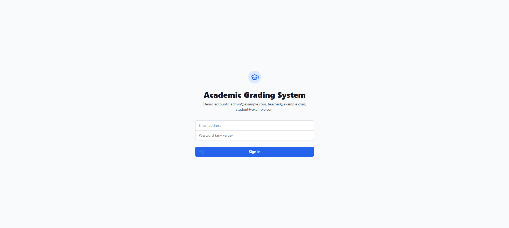
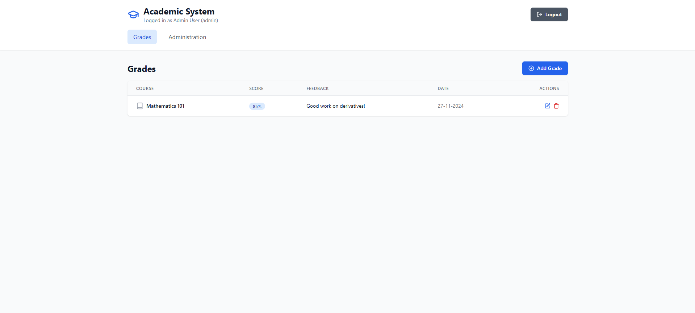
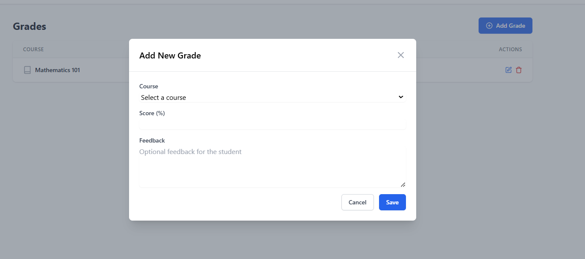
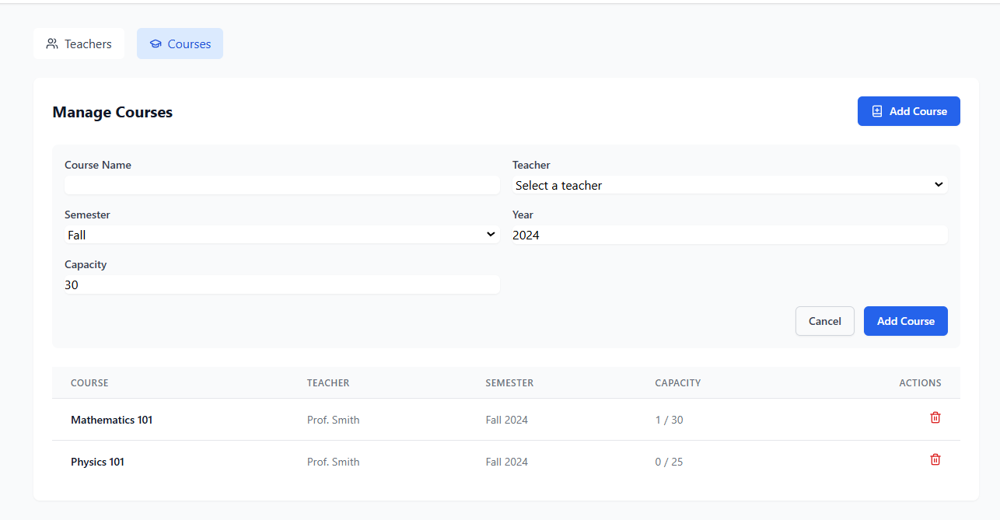
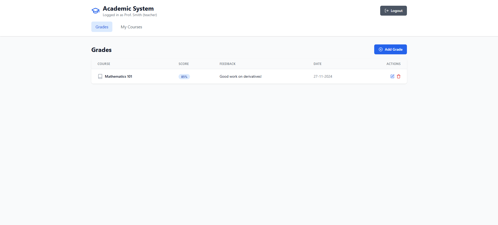
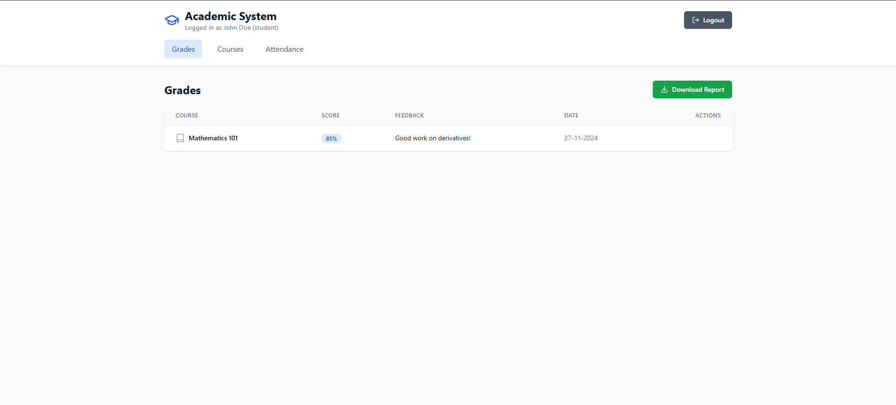
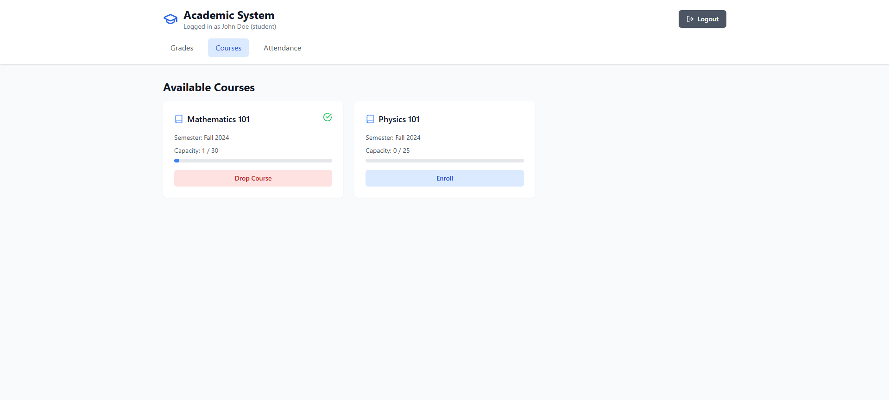
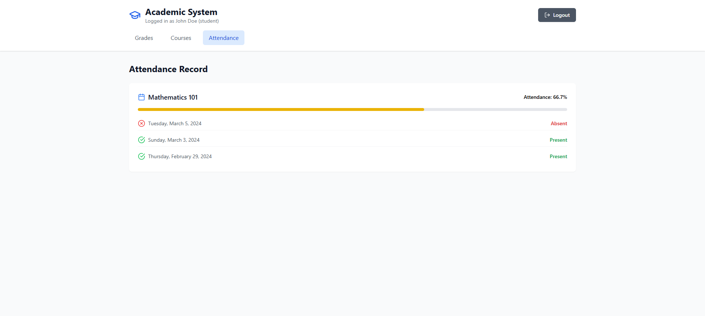

# Sistema de notas

### Descripción General

Este proyecto es un sistema de gestión de notas desarrollado utilizando las siguientes tecnologías:

- **Node.js:** Entorno de ejecución de JavaScript para el backend.
- **Tailwind CSS:** Framework de diseño para la creación de interfaces de usuario personalizadas.
- **React:** Biblioteca de JavaScript para construir interfaces de usuario.
- **Vite:** Herramienta de construcción de frontend rápida.

El sistema está diseñado para administrar información sobre grados, cursos, profesores y estudiantes, permitiendo a los administradores realizar modificaciones y a los estudiantes visualizar su información y realizar acciones como inscribirse o darse de baja de cursos.

## Funcionalidades

### Login

- Acceso a administradores, profesores y estudiantes.



### Administración:

- Gestión de grados: agregar, eliminar y modificar.



- Gestión de cursos: agregar, eliminar y modificar, incluyendo asignación de profesores, semestre y capacidad.





### Profesores:

- Visualización de cursos asignados.




### Estudiantes:

- Visualización de cursos inscritos.



- Descarga de reportes en PDF.


- Inscripción y baja de cursos.



- Seguimiento de asistencia.



## Instalación y Ejecución

1. Clonar el repositorio:

```
git clone https://tu-repositorio.git
```

2. Instalar dependencias:

```
cd sistema-notas
npm install
```

3. Iniciar el servidor de desarrollo:

```
npm run dev
```

